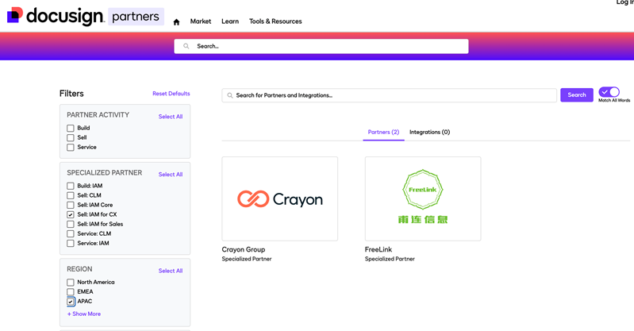

## Docusign Partner Finder 查询结果
Docusign Partner Finder 查询结果   筛选条件为 APAC 与 Sell IAM for CX  查询日期 2026年9月24日

在 Docusign Partner Finder 中，将区域选择为 APAC，再勾选专业化伙伴类别 Sell: IAM for CX，页面只显示两家伙伴：Crayon Group 与 FreeLink。
这意味着，截至2026年9月24日的 Docusign 官方伙伴目录查询结果，FreeLink（甫连信息）是亚太地区仅有的两家 Sell: IAM for CX 专业化伙伴之一。这个结果来自 Docusign 官方目录，任何人都可以按相同条件重新查询。
这项专业化资质意味着什么
Docusign 2025年推出的新一代 Partner Program，把 Specialization 放在合作伙伴能力体系的核心位置。Docusign 官方说明，专业化资质用于验证伙伴在 IAM 与 CLM 方面的熟练度、经验与能力，帮助客户识别能够提供针对性方案的可信顾问。
其中，Sell 轨道要求伙伴以更具策略性和咨询性的方式推动客户采用 Docusign IAM 与 CLM 解决方案；Sell 方向又细分为 IAM Core、IAM for Sales 和 IAM for CX。甫连进入 Sell: IAM for CX 专业化伙伴名单，说明我们在面向客户体验场景的 IAM 咨询、方案判断与市场落地能力，已经进入 Docusign 原厂的专业化伙伴体系。
IAM for CX 处理的是客户旅程中的协议流程。开户、资料收集、服务申请、客户入驻、身份验证、签署与后续系统回写，往往分散在表单、邮件、PDF 和多个业务系统中。Docusign IAM for CX 将 Web Forms、Workflow Builder、Identity Verification、电子签名及系统连接等能力组合起来，减少客户重复填写和人工转交，让协议流程更顺畅。
这类项目真正困难的地方，通常在整个客户流程怎么设计：从哪里发起、收集哪些数据、怎样验证身份、谁来审批、签完写回哪个系统，以及异常出现后由谁处理。
两份原厂认可指向同一种能力
近期，甫连还获得了 Docusign Asia Partner Awards 的 IAM Champion。一项是 Partner Finder 中公开可查的专业化伙伴身份，一项是 Docusign 亚太团队对 IAM 成功、创新与安全体验的公开表彰。两项认可放在一起，呈现的是同一件事：甫连在 Docusign IAM 方向的投入，已经从产品推广延伸到咨询、方案、集成与长期服务。
甫连团队代表领取 Docusign Asia Partner Awards  IAM Champion 奖项
甫连团队提供中英文沟通、Docusign 产品咨询、账号与流程规划、API 与 SDK 集成，以及上线后的持续技术支持。对于中国企业出海和在华跨国团队，我们能够同时理解本地业务沟通方式与海外总部的系统、流程要求，把原厂能力转化为客户真正能运行的方案。
对客户来说，亚太仅有两家之一不是一句为了吸引眼球的口号，而是一个可以在 Docusign 官方目录里复核的选择依据。当企业准备改善开户、申请、入驻、身份验证、签署或客户资料回写流程时，可以进一步确认合作伙伴是否真正理解 IAM for CX，能不能把产品能力接进现有系统，并在上线后持续负责。
如果你的企业正在评估 Docusign IAM for CX，欢迎在公众号后台回复 CX评估。甫连团队可以安排一次15至30分钟线上沟通，结合现有客户流程、系统环境和业务目标，帮助你先把问题和推进路径梳理清楚。
官方核验入口
• FreeLink  Docusign Partner Finder
• Docusign  Ways to Partner
• Docusign  New Partner Program
• Docusign  IAM for CX

## 插入图片

完成审核后，将 `status` 改为 `published` 才会显示在官网。

